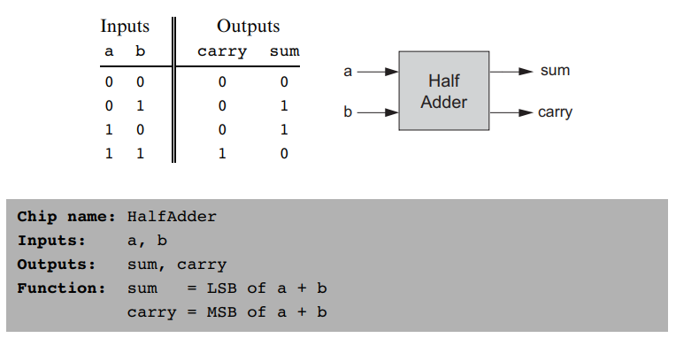

# Project 2

Given the chips implemented in the project 1, implement:

- Half adder
  

- Full adder
  

- 16-bit adder
  

- 16-bit incrementor
  

- Arithmetic Logic Unit (ALU)
  

## ALU operations

The Hack ALU has 6 control bits capable of 2⁶ = 64 different operations
of which 18 interest us:

## Resources

- Materials: [Project2.pdf](https://drive.google.com/file/d/17SzlbKXl0kc5BHsKsKMrOlx-EEpWvq7g/view)
- [Chapter 2 Lecture](https://drive.google.com/file/d/1ie9s3GjM2TrvL7PrEZJ00gEwezgNLOBm/view)
- [Book chapter 2](https://www.nand2tetris.org/_files/ugd/44046b_f0eaab042ba042dcb58f3e08b46bb4d7.pdf)
- And useful guide for troubleshooting chip errors for this project: <https://classes.engineering.wustl.edu/cse365/a2.php>
