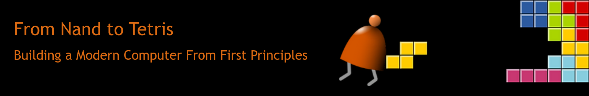

# From Nand to Tetris

<!-- markdownlint-disable MD033 -->

This repository will contain all the project solutions for the
[nand2tetris](https://www.nand2tetris.org/) Digital Design course.

The goal of this course is to build a computer from the ground up, starting with
basic logic gates and ending with a high-level language and operating
system.

## Progress

|     | Project                          | Description                                                                                       |
| --- | -------------------------------- | ------------------------------------------------------------------------------------------------- |
| 🟢 | 1. Boolean Logic                 | Building the elementary gates, their 16-bit variant and the Mux and DMux multi-way variants.      |
| 🟢 | 2. Boolean Arithmetic            | Constructing the Hack ALU, starting from a half adder to a full 16-bit adder with 6 control bits. |
| 🔴 | 3. Sequential Logic              |                                                                                                   |
| 🔴 | 4. Machine Language              |                                                                                                   |
| 🔴 | 5. Computer Architecture         |                                                                                                   |
| 🔴 | 6. Assembler                     |                                                                                                   |
| 🔴 | 7. VM I: Stack Arithmetic        |                                                                                                   |
| 🔴 | 8. VM II: Program Control        |                                                                                                   |
| 🔴 | 9. High-Level Language           |                                                                                                   |
| 🔴 | 10. Compiler I: Syntax Analysis  |                                                                                                   |
| 🔴 | 11. Compiler II: Code Generation |                                                                                                   |
| 🔴 | 12. Operating System             |                                                                                                   |

## External links

- From Nand to Tetris webpage: <https://nand2tetris.org/>
- The Coursera "From Nand to Tetris" course: <https://coursera.org/learn/build-a-computer>
